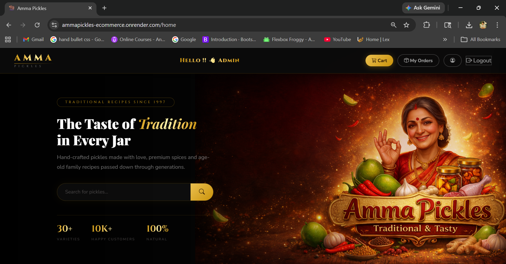
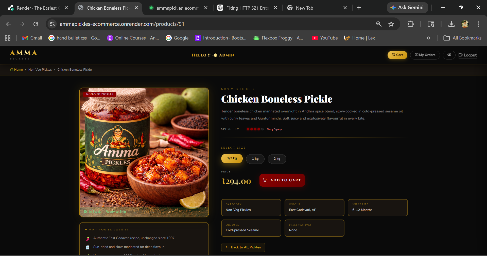
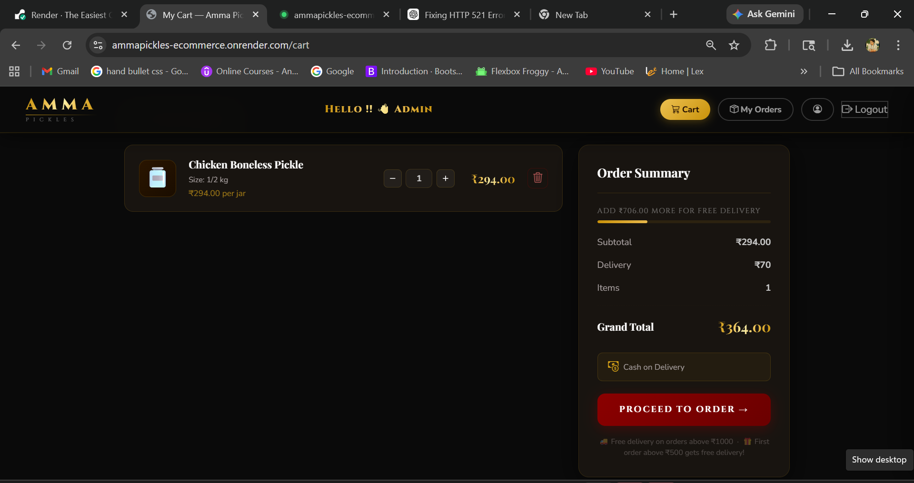
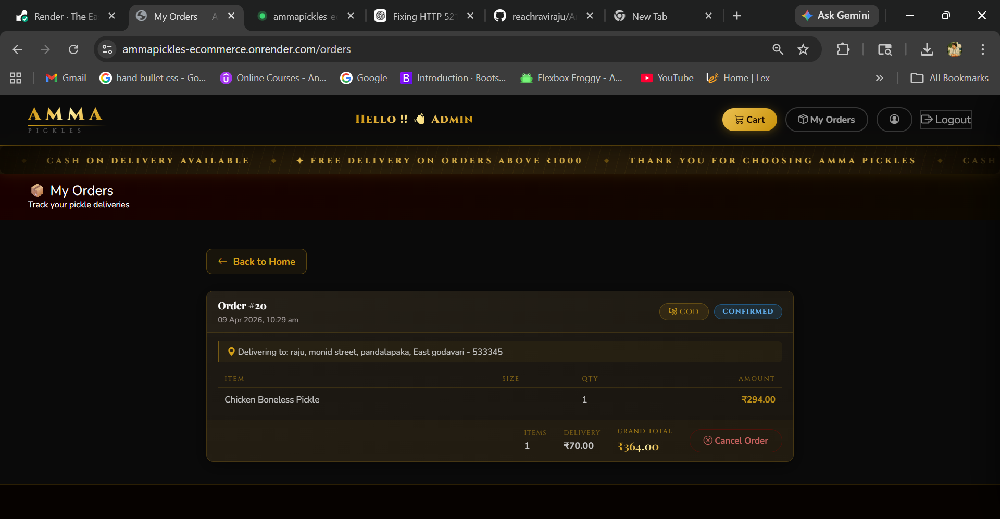
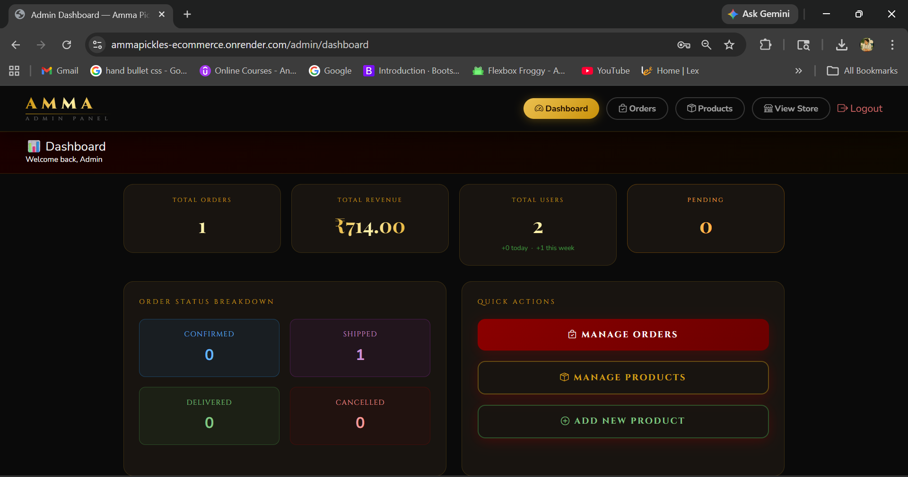

#  Amma Pickles — E-Commerce Platform


> A full-stack e-commerce platform for authentic Andhra homemade pickles — built with Spring Boot, Thymeleaf web frontend, and a complete JWT-secured REST API backend. Containerized with Docker and deployed on Render.

---

## 🌐 Live Demo

👉 [https://ammapickles-ecommerce.onrender.com](https://ammapickles-ecommerce.onrender.com)

> **Note:** Hosted on Render free tier — app may take 30–40 seconds to wake up on first visit.

---

## 📸 Screenshots

### Home Page


### Product Detail


### Cart


### Orders


### Admin Dashboard


---

## 📌 About the Project

**Amma Pickles** is a fully functional online store for ordering traditional Andhra pickles — Veg and Non-Veg varieties available in three sizes (½ kg, 1 kg, 2 kg). The project features a **dual architecture**: a Thymeleaf-rendered web UI for customers, and a JWT-secured REST API for external/mobile access.

**What's working:**
- Browse and search products by name or category
- Product detail page with size variants
- Cart management (add, update, remove, clear)
- Place orders with COD — confirmed immediately
- Flat ₹70 delivery charge (free above ₹1000 or first order above ₹500)
- Stock is deducted on order and restored on cancellation
- Delivery address management
- Session-based web login and JWT-based API login
- Login with email or phone number
- OTP email verification on registration
- Secure forgot-password flow with email token
- Email notifications on registration and order events
- Admin dashboard — manage products, categories, users, and orders
- Real-time registration form validation with debounced API checks

---

## 🏗️ Architecture

This project uses a **dual-layer architecture** — both layers share the same service and repository code:

| Layer | Technology | Auth Method |
|-------|-----------|------------|
| Web Frontend | Thymeleaf + HTML/CSS | Session-based (Spring Security form login) |
| REST API | JSON responses | JWT Bearer Token (stateless) |

---

## 🛠️ Tech Stack

| Category | Technology |
|---------|-----------|
| Language | Java 17 |
| Framework | Spring Boot 3.5.6 |
| ORM | Spring Data JPA / Hibernate |
| Database | MySQL 8.0 |
| Security | Spring Security (JWT + Session) |
| Frontend | Thymeleaf, HTML, CSS |
| Email | Brevo SMTP |
| Caching | Spring Cache |
| Build Tool | Maven |
| Containerization | Docker (multi-stage build) |
| Validation | Jakarta Bean Validation |
| Monitoring | Spring Boot Actuator |
| Utilities | Lombok, SLF4J |

---

## ⚡ Performance Optimizations

| Optimization | Description |
|---|---|
| Spring Cache | Products cached in memory — reduces DB hits on every request |
| Cache Eviction | Cache auto-clears on admin add/update/delete — always fresh data |
| Lazy Initialization | Beans load on demand — reduces startup time by ~40% |
| Database Indexing | Indexes on name, category_id, composite — faster queries |
| Connection Pooling | HikariCP limited to 5 connections — protects free tier DB |
| open-in-view disabled | Prevents unnecessary DB connections during view rendering |

---

## 🚀 Deployment

| Component | Platform |
|---|---|
| Application | Render (Docker container) |
| Database | Aiven MySQL |
| Containerization | Docker (multi-stage build) |
| Email Service | Brevo SMTP |

**Docker multi-stage build** — Stage 1 builds the jar using Maven, Stage 2 runs only the jar using lightweight JRE. Final image is small and production-ready.

---

## 📁 Project Structure

```
src/main/
├── java/com/ammapickles/backend/
│   ├── AmmaPicklesApplication.java
│   ├── config/
│   │   └── AppConfig.java
│   ├── controller/
│   │   ├── AuthController.java          ← REST: /api/auth/**
│   │   ├── AuthViewController.java      ← Web: /login, /register
│   │   ├── ProductController.java       ← REST: /api/products/**
│   │   ├── ProductViewController.java   ← Web: /products/{id}
│   │   ├── HomeViewController.java      ← Web: /home
│   │   ├── CartController.java          ← REST: /api/cart/**
│   │   ├── CartViewController.java      ← Web: /cart
│   │   ├── OrderController.java         ← REST: /api/orders/**
│   │   ├── OrderViewController.java     ← Web: /orders
│   │   ├── CategoryController.java      ← REST: /api/categories/**
│   │   ├── AddressController.java       ← REST: /api/addresses/**
│   │   ├── AddressViewController.java   ← Web: /addresses/**
│   │   └── UserController.java          ← REST: /api/users/**
│   ├── dto/
│   ├── entity/
│   ├── exception/
│   ├── repository/
│   ├── security/
│   └── service/
│
└── resources/
    ├── application.properties
    ├── application.properties.example
    ├── static/
    │   ├── css/style.css
    │   └── images/default-product.png
    └── templates/
        ├── home.html
        ├── login.html
        ├── register.html
        ├── cart.html
        ├── orders.html
        ├── place-order.html
        ├── product-detail.html
        ├── add-address.html
        └── fragments/
            ├── navbar.html
            └── footer.html
```

---

## ⚙️ Setup & Configuration

### Prerequisites
- Java 17+
- MySQL 8.0+
- Maven 3.6+
- Docker (optional — for containerized run)

### 1. Clone the Repository
```bash
git clone https://github.com/reachraviraju/AmmaPickles-Ecommerce.git
cd AmmaPickles-Ecommerce
```

### 2. Create the Database
```sql
CREATE DATABASE amma_pickles;
```

### 3. Insert Required Roles
```sql
USE amma_pickles;
INSERT INTO roles (name) VALUES ('ROLE_CUSTOMER');
INSERT INTO roles (name) VALUES ('ROLE_ADMIN');
```

### 4. Configure application.properties
```bash
cp src/main/resources/application.properties.example src/main/resources/application.properties
```

```properties
spring.application.name=AmmaPickles
server.port=8080

# MySQL
spring.datasource.url=jdbc:mysql://localhost:3306/amma_pickles
spring.datasource.username=your_db_username
spring.datasource.password=your_db_password
spring.datasource.driver-class-name=com.mysql.cj.jdbc.Driver

# JPA
spring.jpa.hibernate.ddl-auto=update
spring.jpa.show-sql=false
spring.jpa.open-in-view=false

# JWT (24 hours expiry)
jwt.secret=your_base64_encoded_secret_key
jwt.expiration=86400000

# Mail (Brevo SMTP)
spring.mail.host=smtp-relay.brevo.com
spring.mail.port=587
spring.mail.username=your_brevo_email
spring.mail.password=your_brevo_smtp_key
app.mail.from=your_sender_email

# Cache
spring.cache.type=simple

# Lazy initialization
spring.main.lazy-initialization=true

# Actuator
management.endpoints.web.exposure.include=health,info
```

### 5. Run the Application
```bash
mvn spring-boot:run
```

Visit: `http://localhost:8080/home`

### 6. Run with Docker
```bash
docker build -t ammapickles .
docker run -p 8080:8080 ammapickles
```

---

## 🔐 Security Configuration

### Web Chain (Session-based)

| Route | Access |
|-------|--------|
| `/`, `/home`, `/products/**` | Public |
| `/login`, `/register` | Public |
| `/css/**`, `/images/**`, `/favicon.ico` | Public |
| `/cart/**`, `/orders/**`, `/addresses/**` | Authenticated (session) |

- Login: `POST /login` with fields `username` (email or phone) and `password`
- Logout: `GET /logout` → redirects to `/home`

### API Chain (JWT — Stateless)

| Route | Access |
|-------|--------|
| `/api/auth/**` | Public |
| `GET /api/products/**`, `GET /api/categories/**` | Public |
| `/actuator/health` | Public |
| `/api/cart/**`, `/api/orders/**`, `/api/addresses/**` | ROLE_CUSTOMER |
| `POST/PUT/DELETE /api/products/**` | ROLE_ADMIN |
| `POST/PUT/DELETE /api/categories/**` | ROLE_ADMIN |
| `/api/orders/admin/**` | ROLE_ADMIN |
| `/actuator/**` | ROLE_ADMIN |
| `/api/users/**` | Authenticated |

**Token format:** `Authorization: Bearer <jwt_token>`
**Token expiry:** 24 hours
**Password encoding:** BCrypt (strength 12)

---

## 🌐 Web Pages (Thymeleaf)

| URL | Page | Auth |
|-----|------|------|
| `/home` | Product catalog — browse, search, filter by category | No |
| `/products/{id}` | Product detail with size variants | No |
| `/login` | Login form (email or phone) | No |
| `/register` | Registration form with live validation | No |
| `/forgot-password` | Request password reset via email | No |
| `/cart` | Shopping cart | Yes |
| `/orders` | Order history | Yes |
| `/orders/place` | Place order — choose delivery address | Yes |
| `/addresses/add` | Add new delivery address | Yes |
| `/admin/dashboard` | Admin dashboard — users, products, orders | ADMIN |

---

## 📦 Product Structure

Each pickle product has **3 size variants**:

| Size | Label | Weight |
|------|-------|--------|
| `SMALL` | ½ kg | 500g |
| `MEDIUM` | 1 kg | 1000g |
| `LARGE` | 2 kg | 2000g |

Products are displayed **grouped by name** on the home and detail pages.

---

## 🚚 Delivery Charge Logic

| Condition | Charge |
|-----------|--------|
| Order total ≥ ₹1000 | FREE |
| First order ≥ ₹500 | FREE |
| All other orders | ₹70 flat |

```
deliveryCharge = ₹0    [if orderTotal ≥ ₹1000 OR first order ≥ ₹500]
deliveryCharge = ₹70   [all other orders]
grandTotal     = totalAmount + deliveryCharge
```

---

## 📋 REST API Endpoints

### Authentication — `/api/auth`

| Method | Endpoint | Auth | Description |
|--------|----------|------|-------------|
| POST | `/api/auth/register` | Public | Register new customer |
| POST | `/api/auth/login` | Public | Login with email or phone, returns JWT |
| POST | `/api/auth/forgot-password` | Public | Send password reset OTP to email |
| POST | `/api/auth/reset-password` | Public | Reset password using OTP token |
| GET | `/api/auth/verify/{token}` | Public | Email verification on registration |

**Register Request:**
```json
{
  "username": "Ravi Raju",
  "email": "ravi@example.com",
  "password": "yourpassword",
  "phoneNumber": "9876543210"
}
```

> Password must be at least 8 characters and contain at least one number and one special character.

**Login Request:**
```json
{
  "email": "ravi@example.com",
  "password": "yourpassword"
}
```

> Can also login with phone number instead of email.

**Login Response:**
```json
{
  "success": true,
  "message": "Login successful",
  "data": {
    "token": "eyJhbGciOiJIUzI1NiJ9...",
    "email": "ravi@example.com",
    "username": "Ravi Raju",
    "role": "ROLE_CUSTOMER"
  }
}
```

---

### Users — `/api/users`

| Method | Endpoint | Auth | Description |
|--------|----------|------|-------------|
| GET | `/api/users/{id}` | Authenticated | Get user by ID |
| GET | `/api/users/email/{email}` | Authenticated | Get user by email |
| PUT | `/api/users/{id}` | Authenticated | Update user details |
| DELETE | `/api/users/{id}` | Authenticated | Delete user account |

---

### Categories — `/api/categories`

| Method | Endpoint | Auth | Description |
|--------|----------|------|-------------|
| GET | `/api/categories` | Public | Get all categories |
| GET | `/api/categories/{id}` | Public | Get category by ID |
| POST | `/api/categories` | ADMIN | Add new category |
| PUT | `/api/categories/{id}` | ADMIN | Update category |
| DELETE | `/api/categories/{id}` | ADMIN | Delete category |

---

### Products — `/api/products`

| Method | Endpoint | Auth | Description |
|--------|----------|------|-------------|
| GET | `/api/products?page=0&size=10&sort=price,asc` | Public | All products (paginated) |
| GET | `/api/products/{id}` | Public | Single product |
| GET | `/api/products/category/{categoryId}` | Public | By category (paginated) |
| GET | `/api/products/search?name=mango` | Public | Search by name |
| GET | `/api/products/grouped` | Public | All products grouped by name with size variants |
| GET | `/api/products/grouped/category/{categoryId}` | Public | Grouped by category |
| GET | `/api/products/grouped/search?keyword=chicken` | Public | Grouped search |
| POST | `/api/products` | ADMIN | Add product |
| PUT | `/api/products/{id}` | ADMIN | Update product |
| DELETE | `/api/products/{id}` | ADMIN | Delete product |

**Grouped Product Response:**
```json
{
  "name": "Mango",
  "description": "Traditional Andhra Avakaya",
  "categoryName": "Veg Pickles",
  "categoryId": 1,
  "variants": [
    { "id": 1, "size": "SMALL", "sizeLabel": "½ kg", "price": 149.00, "inStock": true, "quantity": 20 },
    { "id": 2, "size": "MEDIUM", "sizeLabel": "1 kg", "price": 249.00, "inStock": true, "quantity": 15 },
    { "id": 3, "size": "LARGE", "sizeLabel": "2 kg", "price": 449.00, "inStock": false, "quantity": 0 }
  ]
}
```

---

### Cart — `/api/cart`

| Method | Endpoint | Auth | Description |
|--------|----------|------|-------------|
| GET | `/api/cart/user/{userId}` | CUSTOMER | Get cart with items and total |
| POST | `/api/cart/user/{userId}/product/{productId}?quantity=2` | CUSTOMER | Add item |
| PUT | `/api/cart/item/{cartItemId}?quantity=3` | CUSTOMER | Update quantity |
| DELETE | `/api/cart/item/{cartItemId}` | CUSTOMER | Remove item |
| DELETE | `/api/cart/user/{userId}/clear` | CUSTOMER | Clear cart |

> Adding an existing product to the cart **merges** the quantity rather than duplicating it.
> Adding out-of-stock products is blocked with a clear error message.

---

### Orders — `/api/orders`

#### Customer Endpoints

| Method | Endpoint | Auth | Description |
|--------|----------|------|-------------|
| GET | `/api/orders/user/{userId}` | CUSTOMER | Get my orders |
| GET | `/api/orders/{id}` | CUSTOMER | Get order (JWT-verified ownership) |
| POST | `/api/orders` | CUSTOMER | Place COD order |
| DELETE | `/api/orders/{id}` | CUSTOMER | Cancel order |

**Place Order Request:**
```json
{
  "addressId": 1
}
```

> `userId` is read from the JWT token — not the request body. This prevents placing orders under another user's ID.

**Order Response:**
```json
{
  "id": 12,
  "status": "CONFIRMED",
  "totalAmount": 398.00,
  "deliveryCharge": 70.00,
  "grandTotal": 468.00,
  "orderDate": "2025-01-15T10:30:00",
  "deliveryAddress": "12 Main St, Kurnool, Kurnool - 518001",
  "items": [
    {
      "productId": 5,
      "productName": "Ginger Pickle",
      "quantity": 2,
      "sizeLabel": "1 kg",
      "priceAtTimeOfOrder": 199.00,
      "itemTotal": 398.00
    }
  ]
}
```

**Cancellation rule:** Only `CONFIRMED` orders can be cancelled. Stock is automatically restored.

#### Admin Endpoints

| Method | Endpoint | Auth | Description |
|--------|----------|------|-------------|
| GET | `/api/orders/admin/all?page=0&size=10` | ADMIN | All orders (paginated) |
| GET | `/api/orders/admin/{id}` | ADMIN | Any order by ID |
| PUT | `/api/orders/admin/{id}/status?status=SHIPPED` | ADMIN | Update status |

**Order statuses:** `PENDING` → `CONFIRMED` → `SHIPPED` → `DELIVERED` / `CANCELLED`

---

### Addresses — `/api/addresses`

| Method | Endpoint | Auth | Description |
|--------|----------|------|-------------|
| GET | `/api/addresses/user/{userId}` | CUSTOMER | Get all addresses |
| GET | `/api/addresses/{id}` | CUSTOMER | Get address by ID |
| POST | `/api/addresses/user/{userId}` | CUSTOMER | Add address |
| PUT | `/api/addresses/{id}` | CUSTOMER | Update address |
| DELETE | `/api/addresses/{userId}/{id}` | CUSTOMER | Delete address |

**Address Request:**
```json
{
  "name": "Home",
  "street": "12 Market Road",
  "city": "Kurnool",
  "district": "Kurnool",
  "state": "Andhra Pradesh",
  "pincode": "518001"
}
```

> `pincode` must be exactly 6 digits, cannot start with 0.

---

### Actuator

| Endpoint | Access |
|----------|--------|
| `/actuator/health` | Public |
| `/actuator/info` | Public |
| `/actuator/**` | ADMIN only |

---

## 🗄️ Database Tables

| Table | Description |
|-------|-------------|
| `users` | Customer and admin accounts |
| `roles` | ROLE_CUSTOMER, ROLE_ADMIN |
| `user_roles` | Many-to-many join |
| `categories` | Veg / Non-Veg |
| `products` | All variants (name + size + stock) |
| `carts` | One cart per user |
| `cart_items` | Items with quantity |
| `orders` | Orders with total, delivery charge, status |
| `order_items` | Line items with price snapshot at order time |
| `addresses` | Delivery addresses |
| `password_reset_tokens` | Secure tokens for forgot-password flow |
| `email_verification_tokens` | Tokens for email verification on registration |

---

## ⚠️ Error Handling

All REST errors return a consistent format:

```json
{
  "success": false,
  "message": "Product not found with id: 99",
  "data": null
}
```

| Scenario | HTTP Status |
|----------|------------|
| Resource not found | 404 |
| Duplicate email on register | 400 |
| Empty cart on order | 400 |
| Out of stock on add to cart | 400 |
| Cancelling non-CONFIRMED order | 400 |
| Insufficient stock | 400 |
| Validation errors | 400 |
| Not authenticated | 401 |
| Wrong role | 403 |

---

## 🧪 Testing the API (Postman)

### Step 1 — Register
```
POST https://ammapickles-ecommerce.onrender.com/api/auth/register
Content-Type: application/json

{
  "username": "Test User",
  "email": "test@example.com",
  "password": "test@1234",
  "phoneNumber": "9876543210"
}
```

### Step 2 — Login & Copy Token
```
POST https://ammapickles-ecommerce.onrender.com/api/auth/login
Content-Type: application/json

{
  "email": "test@example.com",
  "password": "test@1234"
}
```

### Step 3 — Set Bearer Token in Postman
Authorization tab → Bearer Token → paste the token.

### Step 4 — Browse Products
```
GET https://ammapickles-ecommerce.onrender.com/api/products/grouped
```

### Step 5 — Add to Cart
```
POST https://ammapickles-ecommerce.onrender.com/api/cart/user/1/product/5?quantity=2
Authorization: Bearer <token>
```

### Step 6 — Add Address
```
POST https://ammapickles-ecommerce.onrender.com/api/addresses/user/1
Authorization: Bearer <token>
Content-Type: application/json

{
  "name": "Home",
  "street": "12 Main Road",
  "city": "Kurnool",
  "district": "Kurnool",
  "state": "Andhra Pradesh",
  "pincode": "518001"
}
```

### Step 7 — Place Order
```
POST https://ammapickles-ecommerce.onrender.com/api/orders
Authorization: Bearer <token>
Content-Type: application/json

{
  "addressId": 1
}
```

---

## 🔜 Planned Features

| Feature | Description | Status |
|---------|------------|--------|
| Product Image Support | Add imageUrl field to products so each pickle displays its own photo | 📋 Planned |
| Razorpay Payment | Online payment integration | 📋 Planned |
| Order Detail Page (Web) | Individual order detail page showing full breakdown | 📋 Planned |
| Interactive Orders Page | Expandable timeline panel with order status tracking | 📋 Planned |

---

## 👨‍💻 Developer

**Ravi Raju Chintalapudi**
Java Backend Developer
🔗 [GitHub: @reachraviraju](https://github.com/reachraviraju)

---

*Built with ❤️ and spice — straight from Andhra.*