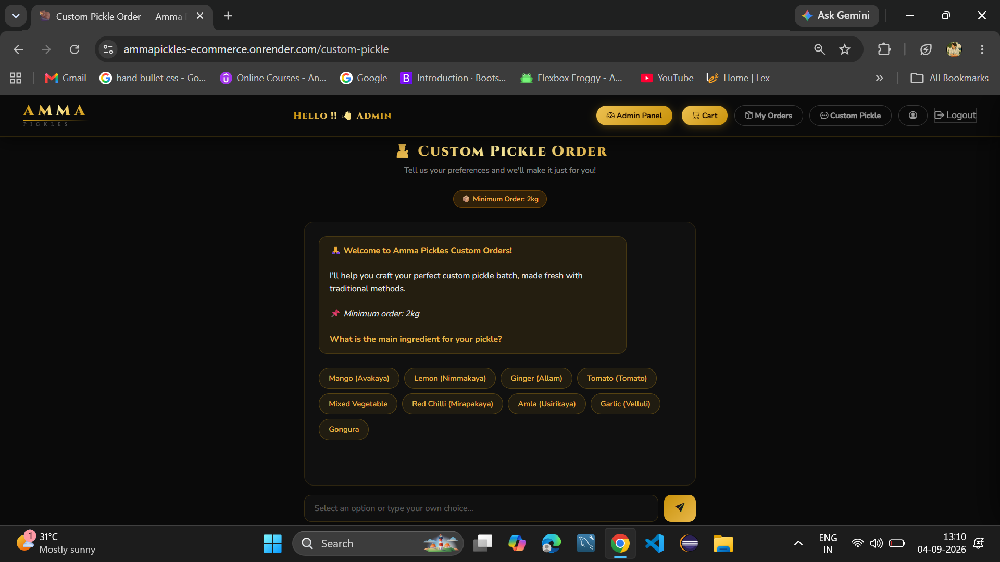

# Amma Pickles — E-commerce Backend (Spring Boot)


A full-stack e-commerce backend for ordering traditional Andhra homemade pickles. Built with Spring Boot, Thymeleaf for the web frontend, and a JWT-secured REST API. Includes a custom pickle ordering feature powered by Google Gemini. Containerized with Docker and deployed on Render.

🔗 **Live:** [https://ammapickles-ecommerce.onrender.com](https://ammapickles-ecommerce.onrender.com)
*(Render free tier — first load may take ~30s to wake up)*

---

## What This Project Does

An online store for Andhra pickles (veg & non-veg), available in ½ kg, 1 kg, and 2 kg sizes.

**Current features:**
- Browse and search products by name or category
- Product detail page with size variants and stock status
- Cart management — add, update quantity, remove, clear
- Place orders (COD) with delivery address selection
- Flat ₹70 delivery charge (free above ₹1000, or first order above ₹500)
- Stock deducted on order placement, restored on cancellation
- Order status lifecycle: `CONFIRMED → SHIPPED → DELIVERED` (or `CANCELLED`)
- Delivery address management
- Session-based web login + JWT-based API login (dual auth)
- Login with email or phone number
- OTP email verification on registration
- Forgot-password flow with email token
- Email notifications on registration and order events (async via Brevo SMTP)
- Custom pickle ordering — conversational chat that collects ingredient preferences and creates a custom order request
- Admin dashboard — manage products, categories, users, standard orders, and custom pickle requests
- Real-time registration form validation with debounced API checks

---

## Architecture

The project uses a **dual-layer architecture** — both layers share the same service and repository code:

| Layer | Technology | Auth Method |
|-------|-----------|-------------|
| Web Frontend | Thymeleaf + HTML/CSS | Session-based (Spring Security form login) |
| REST API | JSON responses | JWT Bearer Token (stateless) |

---

## Tech Stack

| Category | Technology |
|----------|-----------|
| Language | Java 17 |
| Framework | Spring Boot 3.5.6 |
| ORM | Spring Data JPA / Hibernate |
| Database | MySQL 8.0 |
| Security | Spring Security (JWT + Session dual-chain) |
| Frontend | Thymeleaf, HTML, CSS |
| AI / Chat | Google Gemini 1.5 Flash (Generative Language API) |
| Email | Brevo SMTP (async dispatch) |
| Caching | Spring Cache (`@Cacheable`) |
| Build Tool | Maven |
| Containerization | Docker (multi-stage build) |
| Validation | Jakarta Bean Validation |
| Monitoring | Spring Boot Actuator |
| Utilities | Lombok, SLF4J |

---

## Custom Pickle Ordering (Gemini Chat)

Customers can create a custom pickle order through a guided chat interface. The backend uses Google Gemini 1.5 Flash to parse natural language preferences into structured order data.

**What customers can customize:**
- Main ingredient — supports veg (Mango, Lemon, Gongura, Ginger, Tomato, etc.) and non-veg (Chicken, Mutton, Prawns, Fish, Crab)
- Spice level, salt level, oil type (sesame, groundnut, mustard)
- Extra ingredients (garlic, fenugreek, curry leaves, hing)
- Batch size (minimum 2 kg)
- Accepts English and Telugu/Hindi transliterations (e.g. "avakaya", "royyalu", "nimmakaya")

**How it works:**
1. Customer opens the chat page (requires a saved delivery address).
2. A 4-stage progress stepper guides the conversation: Ingredient → Oil & Spice → Quantity → Confirm.
3. Gemini parses the customer's free-text input into structured JSON fields.
4. A Java-side validation layer (`CustomPickleChatService`) cross-checks Gemini's output against a canonical ingredient alias map — this catches cases where general chit-chat or questions get misidentified as ingredient selections.
5. Once all details are gathered, the order is saved to `custom_order_requests`.
6. Admin reviews the request, contacts the customer to agree on pricing, and manages fulfillment through the admin panel.

**Fallback:** If the Gemini API key is not configured or the API is unreachable, the system falls back to a deterministic rule-based conversation flow that still collects all required fields.

**Guardrails:**
- 30-message limit per chat session to prevent abuse
- Max 3 custom orders per customer per 24 hours (checked by phone number + user ID)
- Low temperature (`0.3`) for more consistent structured responses
- Chat transcripts are stored in `chat_messages` and cascade-deleted when an order is removed

---

## Screenshots

### Home Page


### Custom Pickle Chat


### Product Detail


### Cart


### Orders


### Admin Dashboard


---

## Performance & Resource Optimization

This project runs on Render's free tier (512 MB RAM) with Aiven's free MySQL tier, so I had to be deliberate about resource usage.

| What I Did | Why |
|---|---|
| Serial GC + capped RAM (`-XX:+UseSerialGC`, `-XX:MaxRAMPercentage=65.0`) | G1GC was too memory-hungry for 512 MB; Serial GC has lower overhead at the cost of pause time, which is fine for low-traffic |
| `@Async` email dispatch | Decouples SMTP calls from the request thread — checkout doesn't block waiting for Brevo |
| HikariCP pool capped at 4 connections | Aiven free tier has a strict connection limit; keeping the pool small avoids exhausting it |
| `@Cacheable` on product listings | Avoids repeated DB queries for the same catalog data; cache is evicted on admin write operations |
| `spring.main.lazy-initialization=true` | Loads beans on demand to reduce startup memory; helps on cold starts |
| Database indexes on hot query paths | Indexes on `orders(user_id, status, order_date)`, `users(created_at)`, `products(name, category_id)`, and custom order fields |
| `CustomUserDetails` in session | Reads user ID and role from the security principal directly, avoiding a `findByEmail` DB call on every request |
| `LinkedHashMap` for variant grouping | Preserves insertion order so product size variants display consistently (½ kg → 1 kg → 2 kg) |

---

## Deployment

| Component | Platform | Notes |
|---|---|---|
| Application | Render (Docker) | 512 MB RAM, Serial GC, auto-sleeps on inactivity |
| Database | Aiven MySQL 8.0 | SSL required, max 4 pool connections |
| Email | Brevo SMTP | Async background dispatch |
| Container | Docker multi-stage build | Stage 1: Maven build → Stage 2: JRE-only image with tuned JVM flags |

---

## Project Structure

```
src/main/
├── java/com/ammapickles/backend/
│   ├── AmmaPicklesApplication.java
│   ├── config/
│   │   └── AppConfig.java
│   ├── controller/
│   │   ├── AuthController.java              ← REST: /api/auth/**
│   │   ├── AuthViewController.java          ← Web: /login, /register
│   │   ├── ProductController.java           ← REST: /api/products/**
│   │   ├── ProductViewController.java       ← Web: /products/{id}
│   │   ├── HomeViewController.java          ← Web: /home
│   │   ├── CartController.java              ← REST: /api/cart/**
│   │   ├── CartViewController.java          ← Web: /cart
│   │   ├── OrderController.java             ← REST: /api/orders/**
│   │   ├── OrderViewController.java         ← Web: /orders
│   │   ├── CategoryController.java          ← REST: /api/categories/**
│   │   ├── AddressController.java           ← REST: /api/addresses/**
│   │   ├── AddressViewController.java       ← Web: /addresses/**
│   │   ├── CustomPickleChatController.java  ← Web + API: /custom-pickle/**
│   │   ├── AdminViewController.java         ← Web: /admin/dashboard
│   │   ├── AdminCustomOrderViewController.java ← Web: /admin/custom-orders/**
│   │   ├── ProfileViewController.java       ← Web: /profile
│   │   └── UserController.java              ← REST: /api/users/**
│   ├── dto/
│   ├── entity/
│   ├── exception/
│   ├── repository/
│   ├── security/
│   └── service/
│       ├── GeminiService.java               ← Gemini API integration
│       ├── CustomPickleChatService.java      ← Chat logic + fallback engine
│       └── impl/
│
└── resources/
    ├── application.properties
    ├── application.properties.example
    ├── static/
    │   ├── css/style.css
    │   └── images/default-product.png
    └── templates/
        ├── home.html
        ├── login.html
        ├── register.html
        ├── cart.html
        ├── orders.html
        ├── place-order.html
        ├── product-detail.html
        ├── profile.html
        ├── custom-pickle-chat.html
        ├── add-address.html
        ├── forgot-password.html
        ├── reset-password.html
        ├── error.html
        ├── fragments/
        │   ├── navbar.html
        │   └── footer.html
        └── admin/
            └── custom-orders.html
```

---

## Setup & Configuration

### Prerequisites
- Java 17+
- MySQL 8.0+
- Maven 3.6+
- Docker (optional)

### 1. Clone the Repository
```bash
git clone https://github.com/reachraviraju/AmmaPickles-Ecommerce.git
cd AmmaPickles-Ecommerce
```

### 2. Create the Database
```sql
CREATE DATABASE amma_pickles;
```

### 3. Insert Required Roles
```sql
USE amma_pickles;
INSERT INTO roles (name) VALUES ('ROLE_CUSTOMER');
INSERT INTO roles (name) VALUES ('ROLE_ADMIN');
```

### 4. Configure application.properties
```bash
cp src/main/resources/application.properties.example src/main/resources/application.properties
```

```properties
spring.application.name=AmmaPickles
server.port=8080

# MySQL
spring.datasource.url=jdbc:mysql://localhost:3306/amma_pickles
spring.datasource.username=your_db_username
spring.datasource.password=your_db_password
spring.datasource.driver-class-name=com.mysql.cj.jdbc.Driver

# JPA
spring.jpa.hibernate.ddl-auto=update
spring.jpa.show-sql=false
spring.jpa.open-in-view=false

# JWT (24 hours expiry)
jwt.secret=your_base64_encoded_secret_key
jwt.expiration=86400000

# Mail (Brevo SMTP)
spring.mail.host=smtp-relay.brevo.com
spring.mail.port=587
spring.mail.username=your_brevo_email
spring.mail.password=your_brevo_smtp_key
app.mail.from=your_sender_email

# Google Gemini (optional — falls back to rule-based chat if not set)
gemini.api.key=your_gemini_api_key

# Cache
spring.cache.type=simple

# Lazy initialization
spring.main.lazy-initialization=true

# Actuator
management.endpoints.web.exposure.include=health,info
```

### 5. Run the Application
```bash
mvn spring-boot:run
```

Visit: `http://localhost:8080/home`

### 6. Run with Docker
```bash
docker build -t ammapickles .
docker run -p 8080:8080 ammapickles
```

---

## Security Configuration

### Web Chain (Session-based)

| Route | Access |
|-------|--------|
| `/`, `/home`, `/products/**` | Public |
| `/login`, `/register` | Public |
| `/css/**`, `/images/**`, `/favicon.ico` | Public |
| `/cart/**`, `/orders/**`, `/addresses/**` | Authenticated (session) |
| `/admin/**` | ROLE_ADMIN |

- Login: `POST /login` with `username` (email or phone) and `password`
- Logout: `GET /logout` → redirects to `/home`

### API Chain (JWT — Stateless)

| Route | Access |
|-------|--------|
| `/api/auth/**` | Public |
| `GET /api/products/**`, `GET /api/categories/**` | Public |
| `/actuator/health` | Public |
| `/api/cart/**`, `/api/orders/**`, `/api/addresses/**` | ROLE_CUSTOMER |
| `POST/PUT/DELETE /api/products/**` | ROLE_ADMIN |
| `POST/PUT/DELETE /api/categories/**` | ROLE_ADMIN |
| `/api/orders/admin/**` | ROLE_ADMIN |
| `/actuator/**` | ROLE_ADMIN |
| `/api/users/**` | Authenticated |

**Token format:** `Authorization: Bearer <jwt_token>`
**Token expiry:** 24 hours
**Password encoding:** BCrypt (strength 12)

---

## Web Pages (Thymeleaf)

| URL | Page | Auth |
|-----|------|------|
| `/home` | Product catalog — browse, search, filter | No |
| `/products/{id}` | Product detail with size variants | No |
| `/login` | Login form (email or phone) | No |
| `/register` | Registration with live validation | No |
| `/forgot-password` | Request password reset | No |
| `/cart` | Shopping cart | Yes |
| `/orders` | Order history | Yes |
| `/orders/place` | Place order — choose delivery address | Yes |
| `/addresses/add` | Add delivery address | Yes |
| `/profile` | User profile | Yes |
| `/custom-pickle` | Custom pickle chat | Yes |
| `/admin/dashboard` | Admin dashboard | ADMIN |
| `/admin/custom-orders` | Manage custom pickle orders | ADMIN |

---

## REST API Endpoints

### Authentication — `/api/auth`

| Method | Endpoint | Auth | Description |
|--------|----------|------|-------------|
| POST | `/api/auth/register` | Public | Register new customer |
| POST | `/api/auth/login` | Public | Login (email or phone), returns JWT |
| POST | `/api/auth/forgot-password` | Public | Send password reset OTP |
| POST | `/api/auth/reset-password` | Public | Reset password using OTP |
| GET | `/api/auth/verify/{token}` | Public | Email verification |

**Register:**
```json
{
  "username": "Ravi Raju",
  "email": "ravi@example.com",
  "password": "yourpassword",
  "phoneNumber": "9876543210"
}
```

> Password must be at least 8 characters with at least one number and one special character.

**Login:**
```json
{
  "email": "ravi@example.com",
  "password": "yourpassword"
}
```

> Can also login with phone number instead of email.

**Login Response:**
```json
{
  "success": true,
  "message": "Login successful",
  "data": {
    "token": "eyJhbGciOiJIUzI1NiJ9...",
    "email": "ravi@example.com",
    "username": "Ravi Raju",
    "role": "ROLE_CUSTOMER"
  }
}
```

---

### Users — `/api/users`

| Method | Endpoint | Auth | Description |
|--------|----------|------|-------------|
| GET | `/api/users/{id}` | Authenticated | Get user by ID |
| GET | `/api/users/email/{email}` | Authenticated | Get user by email |
| PUT | `/api/users/{id}` | Authenticated | Update user |
| DELETE | `/api/users/{id}` | Authenticated | Delete user |

---

### Categories — `/api/categories`

| Method | Endpoint | Auth | Description |
|--------|----------|------|-------------|
| GET | `/api/categories` | Public | Get all categories |
| GET | `/api/categories/{id}` | Public | Get by ID |
| POST | `/api/categories` | ADMIN | Add category |
| PUT | `/api/categories/{id}` | ADMIN | Update category |
| DELETE | `/api/categories/{id}` | ADMIN | Delete category |

---

### Products — `/api/products`

| Method | Endpoint | Auth | Description |
|--------|----------|------|-------------|
| GET | `/api/products?page=0&size=10&sort=price,asc` | Public | All products (paginated) |
| GET | `/api/products/{id}` | Public | Single product |
| GET | `/api/products/category/{categoryId}` | Public | By category |
| GET | `/api/products/search?name=mango` | Public | Search by name |
| GET | `/api/products/grouped` | Public | Grouped by name with variants |
| GET | `/api/products/grouped/category/{categoryId}` | Public | Grouped by category |
| GET | `/api/products/grouped/search?keyword=chicken` | Public | Grouped search |
| POST | `/api/products` | ADMIN | Add product |
| PUT | `/api/products/{id}` | ADMIN | Update product |
| DELETE | `/api/products/{id}` | ADMIN | Delete product |

**Grouped Product Response:**
```json
{
  "name": "Mango",
  "description": "Traditional Andhra Avakaya",
  "categoryName": "Veg Pickles",
  "categoryId": 1,
  "variants": [
    { "id": 1, "size": "SMALL", "sizeLabel": "½ kg", "price": 149.00, "inStock": true, "quantity": 20 },
    { "id": 2, "size": "MEDIUM", "sizeLabel": "1 kg", "price": 249.00, "inStock": true, "quantity": 15 },
    { "id": 3, "size": "LARGE", "sizeLabel": "2 kg", "price": 449.00, "inStock": false, "quantity": 0 }
  ]
}
```

---

### Cart — `/api/cart`

| Method | Endpoint | Auth | Description |
|--------|----------|------|-------------|
| GET | `/api/cart/user/{userId}` | CUSTOMER | Get cart |
| POST | `/api/cart/user/{userId}/product/{productId}?quantity=2` | CUSTOMER | Add item |
| PUT | `/api/cart/item/{cartItemId}?quantity=3` | CUSTOMER | Update quantity |
| DELETE | `/api/cart/item/{cartItemId}` | CUSTOMER | Remove item |
| DELETE | `/api/cart/user/{userId}/clear` | CUSTOMER | Clear cart |

> Adding an existing product merges the quantity. Out-of-stock products are blocked.

---

### Orders — `/api/orders`

#### Customer

| Method | Endpoint | Auth | Description |
|--------|----------|------|-------------|
| GET | `/api/orders/user/{userId}` | CUSTOMER | Get my orders |
| GET | `/api/orders/{id}` | CUSTOMER | Get order (ownership verified via JWT) |
| POST | `/api/orders` | CUSTOMER | Place COD order |
| DELETE | `/api/orders/{id}` | CUSTOMER | Cancel order |

**Place Order:**
```json
{
  "addressId": 1
}
```

> `userId` is extracted from the JWT token, not the request body.

**Order Response:**
```json
{
  "id": 12,
  "status": "CONFIRMED",
  "totalAmount": 398.00,
  "deliveryCharge": 70.00,
  "grandTotal": 468.00,
  "orderDate": "2025-01-15T10:30:00",
  "deliveryAddress": "12 Main St, Kurnool, Kurnool - 518001",
  "items": [
    {
      "productId": 5,
      "productName": "Ginger Pickle",
      "quantity": 2,
      "sizeLabel": "1 kg",
      "priceAtTimeOfOrder": 199.00,
      "itemTotal": 398.00
    }
  ]
}
```

Only `CONFIRMED` orders can be cancelled. Stock is restored on cancellation.

#### Admin

| Method | Endpoint | Auth | Description |
|--------|----------|------|-------------|
| GET | `/api/orders/admin/all?page=0&size=10` | ADMIN | All orders (paginated) |
| GET | `/api/orders/admin/{id}` | ADMIN | Any order by ID |
| PUT | `/api/orders/admin/{id}/status?status=SHIPPED` | ADMIN | Update status |

Status transitions: `PENDING → CONFIRMED → SHIPPED → DELIVERED` / `CANCELLED`

---

### Addresses — `/api/addresses`

| Method | Endpoint | Auth | Description |
|--------|----------|------|-------------|
| GET | `/api/addresses/user/{userId}` | CUSTOMER | Get all addresses |
| GET | `/api/addresses/{id}` | CUSTOMER | Get by ID |
| POST | `/api/addresses/user/{userId}` | CUSTOMER | Add address |
| PUT | `/api/addresses/{id}` | CUSTOMER | Update address |
| DELETE | `/api/addresses/{userId}/{id}` | CUSTOMER | Delete address |

**Address Request:**
```json
{
  "name": "Home",
  "street": "12 Market Road",
  "city": "Kurnool",
  "district": "Kurnool",
  "state": "Andhra Pradesh",
  "pincode": "518001"
}
```

> `pincode` must be exactly 6 digits, cannot start with 0.

---

### Actuator

| Endpoint | Access |
|----------|--------|
| `/actuator/health` | Public |
| `/actuator/info` | Public |
| `/actuator/**` | ADMIN only |

---

## Database Tables

| Table | Purpose |
|-------|---------|
| `users` | Customer and admin accounts |
| `roles` | ROLE_CUSTOMER, ROLE_ADMIN |
| `user_roles` | Many-to-many join table |
| `categories` | Veg / Non-Veg |
| `products` | All variants (name + size + stock) |
| `carts` | One cart per user |
| `cart_items` | Cart line items with quantity |
| `orders` | Orders with total, delivery charge, status |
| `order_items` | Line items with price snapshot at order time |
| `addresses` | Delivery addresses |
| `custom_order_requests` | Custom pickle orders from chat |
| `chat_messages` | Chat transcripts per session |
| `password_reset_tokens` | Tokens for forgot-password flow |
| `email_verification_tokens` | Tokens for registration email verification |

---

## Delivery Charge Logic

| Condition | Charge |
|-----------|--------|
| Order total ≥ ₹1000 | Free |
| First order ≥ ₹500 | Free |
| All other orders | ₹70 flat |

---

## Error Handling

All REST errors return a consistent format:

```json
{
  "success": false,
  "message": "Product not found with id: 99",
  "data": null
}
```

| Scenario | HTTP Status |
|----------|-------------|
| Resource not found | 404 |
| Duplicate email on register | 400 |
| Empty cart on order | 400 |
| Out of stock | 400 |
| Cancelling non-CONFIRMED order | 400 |
| Insufficient stock | 400 |
| Validation errors | 400 |
| Not authenticated | 401 |
| Wrong role | 403 |

---

## Testing the API (Postman)

### 1. Register
```
POST /api/auth/register
```

### 2. Login & Copy Token
```
POST /api/auth/login
```

### 3. Set Bearer Token
Authorization tab → Bearer Token → paste token.

### 4. Browse Products
```
GET /api/products/grouped
```

### 5. Add to Cart
```
POST /api/cart/user/1/product/5?quantity=2
```

### 6. Add Address
```
POST /api/addresses/user/1
```

### 7. Place Order
```
POST /api/orders
{ "addressId": 1 }
```

---

## Planned Features

| Feature | Status |
|---------|--------|
| Product image support (imageUrl field per product) | Planned |
| Razorpay online payment integration | Planned |
| Individual order detail page with full breakdown | Planned |
| Expandable order timeline with status tracking | Planned |

---

## Developer

**Ravi Raju Chintalapudi**
Java Backend Developer
[GitHub: @reachraviraju](https://github.com/reachraviraju)
